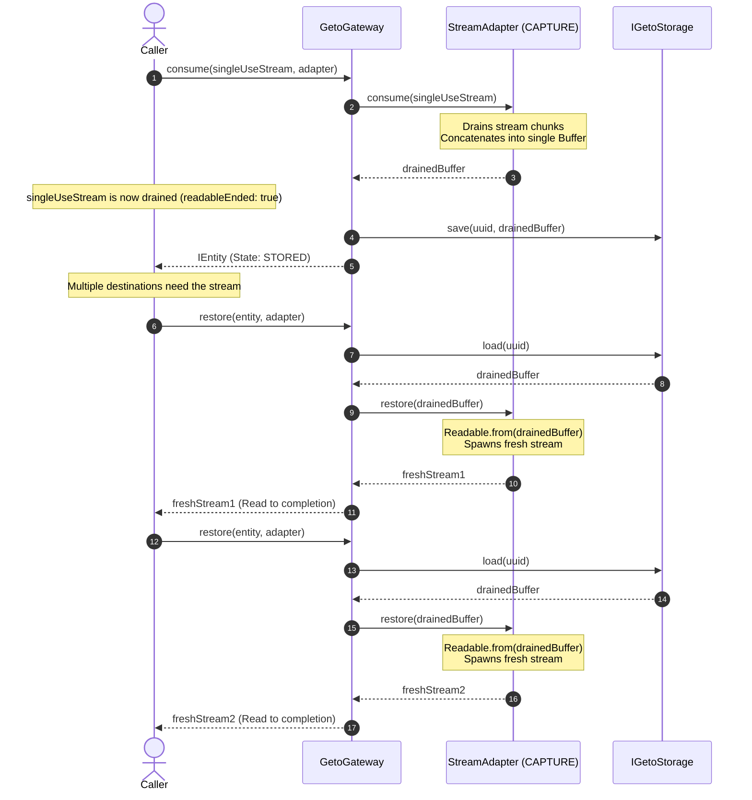

# `CAPTURE` Semantic Specification

| Property | Details |
|---|---|
| **Semantic Identifier** | `EConsumptionSemantic.CAPTURE` (`'capture'`) |
| **Built-in Implementation** | `StreamAdapter` |
| **Source Type ($T$)** | Node.js `Readable` Stream |
| **Representation Type ($R$)** | Binary `Buffer` |
| **Ownership Model** | Destructive Ingestion & Infinite Replay |
| **Release Hook** | Cleans up active stream handle if aborted early |

---

## 1. Mental Model & Problem Statement

Node.js `Readable` streams operate under a pull/push model designed to conserve memory. However, streams possess an inherent limitation: **they can only be read once**. Once a stream emits its `'end'` or `'close'` event, it is spent. It cannot be rewound, sought, or piped into a second destination.

This creates severe architectural friction when:
- An uploaded file stream needs to be hashed for SHA-256 integrity, scanned for malware, AND uploaded to cloud storage.
- A downstream HTTP upload fails midway through transmission and requires an automated retry.
- Multiple decoupled middlewares need to examine the raw request payload.

The **`CAPTURE`** semantic solves this by:
1. Taking control of the ephemeral, single-use resource.
2. Draining all incoming chunks into an intact byte representation stored in the configured backend.
3. Supplying **fresh, newly minted `Readable` instances** on every invocation of `gateway.restore()`, allowing infinite, non-destructive replay.

---

## 2. Sequence Diagram



---

## 3. Lifecycle Behaviors

| Operation | Action Taken | Entity State Transition | Error Conditions |
|---|---|---|---|
| `consume(stream, adapter)` | Listens to `'data'`, `'error'`, and `'end'` events. Collects chunks into an internal array and computes final `Buffer.concat()`. Persists to storage. | `[Initial]` &rarr; `STORED` | Throws `AdapterError` if the stream emits an `'error'` event during draining, or if the argument is not a valid stream. |
| `restore(entity, adapter)` | Loads buffer representation from storage, instantiates a fresh `Readable` instance via `Readable.from(buf)`. | Unchanged (`STORED` or `RELEASED`) | Throws `EntityNotFoundError` if ID missing. Throws `EntityStateError` if `DELETED`. |
| `release(entity, adapter)` | If stream is still active/open, destroys it with `stream.destroy()`. Marks entity as `RELEASED`. | `STORED` &rarr; `RELEASED` | Throws `EntityStateError` if already `DELETED`. |
| `delete(id)` | Evicts buffered stream representation from storage. | `*` &rarr; `DELETED` | Throws `EntityNotFoundError` if not found. Throws `EntityStateError` if already `DELETED`. |

---

## 4. Production TypeScript Example

```typescript
import { Readable } from 'node:stream';
import { GetoGateway, MemoryStorage, StreamAdapter, IEntity } from '@mrjacket/geto';

async function streamToString(stream: Readable): Promise<string> {
  const chunks: Buffer[] = [];
  for await (const chunk of stream) {
    chunks.push(typeof chunk === 'string' ? Buffer.from(chunk) : chunk);
  }
  return Buffer.concat(chunks).toString('utf-8');
}

async function run() {
  const gateway = new GetoGateway({ storage: new MemoryStorage() });
  const adapter = new StreamAdapter();

  // 1. Simulate an ephemeral incoming multipart payload stream
  const incoming = Readable.from([
    '--boundary\r\n',
    'Content-Disposition: form-data; name="data"\r\n\r\n',
    'Vital Payload Content\r\n',
    '--boundary--'
  ]);

  // 2. Capture the stream
  const entity: IEntity = await gateway.consume(incoming, adapter, {
    metadata: { contentType: 'multipart/form-data', receivedAt: Date.now() }
  });

  console.log('Stream consumed. Readable ended?', incoming.readableEnded); // true

  // 3. Dispatch replay stream 1: Security Scanning Service
  const scanStream = await gateway.restore(entity, adapter);
  const scanContent = await streamToString(scanStream);
  console.log(`Scan Service consumed ${scanContent.length} bytes`);

  // 4. Dispatch replay stream 2: Database / Cloud Archival Service
  const archiveStream = await gateway.restore(entity, adapter);
  const archiveContent = await streamToString(archiveStream);
  console.log(`Archive Service consumed ${archiveContent.length} bytes`);

  // 5. Clean up entity
  await gateway.delete(entity.id);
}

run().catch(console.error);
```

---

## 5. Memory & Throughput Considerations

- **Buffer Aggregation in Memory:** `StreamAdapter` buffers the entire stream content into memory before saving to storage. For standard web payloads, JSON documents, PDFs, and moderate file uploads (< 100MB), this is fast and predictable.
- **Large Files (> 1GB):** If buffering gigabyte-sized files, ensure your Node.js process has sufficient heap memory, or configure `FileStorage` so the final buffer is flushed directly to disk and unreferenced from V8 memory.
- **Empty Streams:** Draining an empty stream (`Readable.from([])`) is safely supported, producing a valid zero-length buffer representation.
