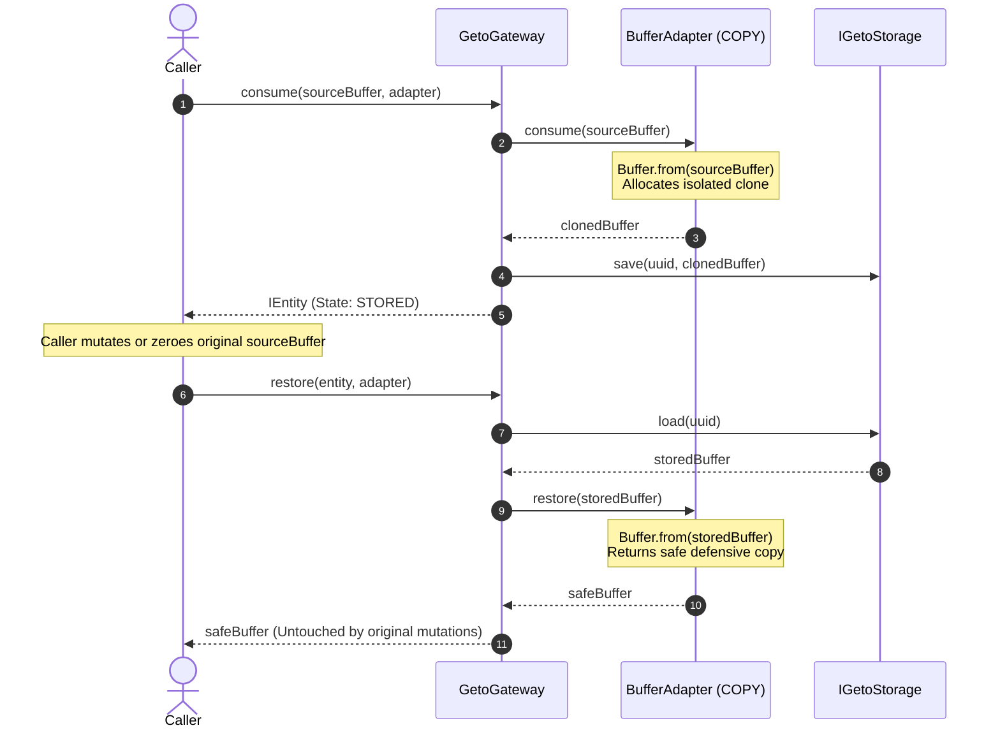

# `COPY` Semantic Specification

| Property | Details |
|---|---|
| **Semantic Identifier** | `EConsumptionSemantic.COPY` (`'copy'`) |
| **Built-in Implementation** | `BufferAdapter` |
| **Source Type ($T$)** | `Buffer` |
| **Representation Type ($R$)** | `Buffer` |
| **Ownership Model** | Value Isolation (Caller retains original; Gateway stores independent clone) |
| **Release Hook** | None required (No OS handles or active descriptors) |

---

## 1. Mental Model & Problem Statement

In JavaScript and Node.js runtimes, `Buffer` instances are mutable references backed by memory outside the V8 heap (`ArrayBuffer`). Passing a buffer around without cloning introduces subtle, catastrophic bugs:
- A caller might zero-out a buffer after sending it (`buf.fill(0)`).
- A socket pool or HTTP parser might reuse the same underlying `Buffer` chunk for the next request.
- Concurrent workers may mutate byte offsets simultaneously.

The **`COPY`** semantic enforces **strict value isolation**. When a resource is consumed under the `COPY` semantic:
1. An independent, detached copy of the byte array is allocated.
2. The caller retains complete freedom to mutate, reuse, or destroy the original instance.
3. The stored representation is completely immune to external side effects.
4. `restore()` returns another fresh clone, ensuring that consumers of the restored entity cannot mutate the persisted storage.

---

## 2. Sequence Diagram



---

## 3. Lifecycle Behaviors

| Operation | Action Taken | Entity State Transition | Error Conditions |
|---|---|---|---|
| `consume(buf, adapter)` | Validates buffer, clones byte array via `Buffer.from(buf)`, persists to storage. | `[Initial]` &rarr; `STORED` | Throws `AdapterError` if resource is not a valid `Buffer`. Throws `StorageError` if storage fails. |
| `restore(entity, adapter)` | Loads clone from storage, returns defensive copy. | Unchanged (`STORED` or `RELEASED`) | Throws `EntityNotFoundError` if ID missing. Throws `EntityStateError` if `DELETED`. |
| `release(entity, adapter)` | No-op in `BufferAdapter` (no handles). Updates state. | `STORED` &rarr; `RELEASED` | Throws `EntityStateError` if already `DELETED`. |
| `delete(id)` | Evicts buffer from storage backend. | `*` &rarr; `DELETED` | Throws `EntityNotFoundError` if not found. Throws `EntityStateError` if already `DELETED`. |

---

## 4. Production TypeScript Example

```typescript
import { GetoGateway, MemoryStorage, BufferAdapter, IEntity } from '@mrjacket/geto';

async function run() {
  const gateway = new GetoGateway({ storage: new MemoryStorage() });
  const adapter = new BufferAdapter();

  // 1. Ingest cryptographic key material
  const secretKey = Buffer.from('4f8b92c81a2e9d3b5c7f1a0e8d2c4b6a');

  const entity: IEntity = await gateway.consume(secretKey, adapter, {
    metadata: { keyId: 'kms-master-01', algorithm: 'aes-256-gcm' }
  });

  console.log(`Entity created: ${entity.id} (State: ${entity.state})`);

  // 2. Wipe caller memory to prevent accidental exposure in memory dumps
  secretKey.fill(0);
  console.log('Original memory zeroed:', secretKey.toString('hex'));

  // 3. Rehydrate from gateway when encryption is needed
  const activeKey = await gateway.restore(entity, adapter);
  console.log('Restored key integrity verified:', activeKey.toString('utf-8') === '4f8b92c81a2e9d3b5c7f1a0e8d2c4b6a');

  // 4. Safe deletion when lifecycle concludes
  await gateway.delete(entity.id);
}

run().catch(console.error);
```

---

## 5. Performance & Resource Considerations

- **Memory Overhead:** `COPY` duplicates the byte length of the input. Consuming a 100 MB buffer requires an additional 100 MB of heap/buffer allocation. For multi-gigabyte files or continuous streams, prefer the [`CAPTURE`](./capture.md) or [`REGISTER`](./register.md) semantics.
- **Garbage Collection:** Once `delete()` is called on the gateway, the cloned buffer is dereferenced in storage and becomes eligible for V8 garbage collection.
- **Zero-Length Buffers:** `BufferAdapter` explicitly supports zero-length buffers (`Buffer.alloc(0)`), producing an empty valid clone without errors.
