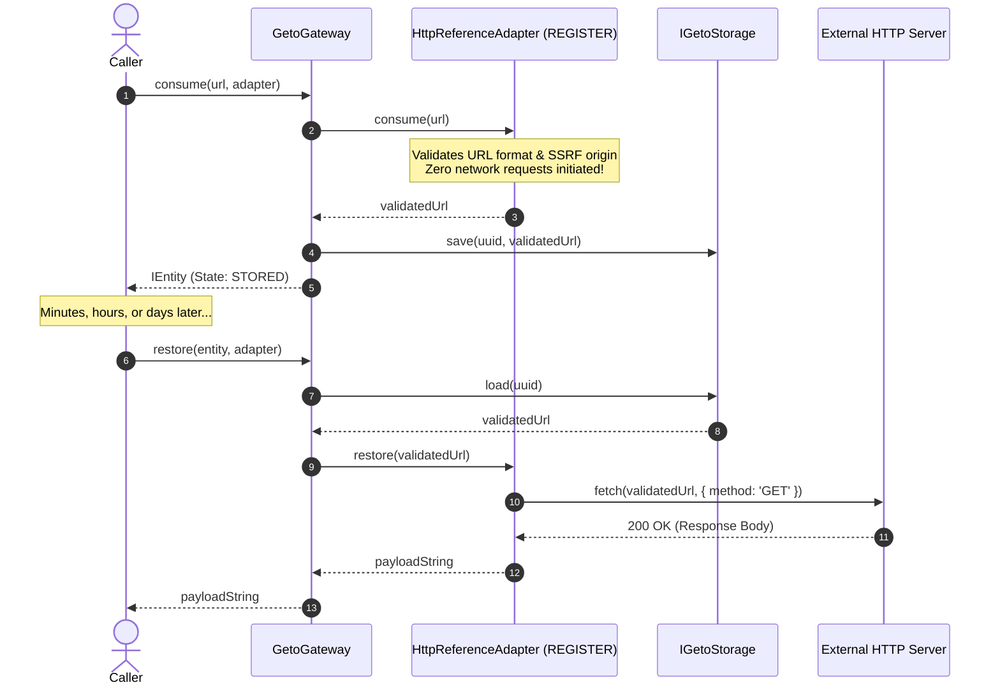

# `REGISTER` Semantic Specification

| Property | Details |
|---|---|
| **Semantic Identifier** | `EConsumptionSemantic.REGISTER` (`'register'`) |
| **Built-in Implementation** | `HttpReferenceAdapter` |
| **Source Type ($T$)** | Validated URL Locator (`string`) |
| **Representation Type ($R$)** | Normalized URL Locator (`string`) |
| **Ownership Model** | Pointer / Locator Registration with Deferred Resolution |
| **Release Hook** | None required (Network requests are stateless) |

---

## 1. Mental Model & Problem Statement

In distributed cloud architectures, applications frequently handle references to external data:
- Presigned S3 download URLs.
- CDN asset paths.
- Third-party webhook payloads pointing to remote images or files.

Fetching data eagerly at the moment of intake causes severe bottlenecks:
1. **Network Saturation:** Ingesting 10,000 URLs creates immediate socket pool exhaustion.
2. **Wasted Bandwidth:** Often, only a small percentage of ingested references are ever downloaded or requested by users.
3. **SSRF Vulnerabilities:** Eagerly dereferencing arbitrary caller-provided URLs invites Server-Side Request Forgery attacks, exposing internal VPCs and cloud metadata endpoints (`http://169.254.169.254`).

The **`REGISTER`** semantic decouples resource registration from resource resolution:
- **`consume()` is zero-network:** The locator is validated against origin allowlists and saved into storage in microseconds without making any network calls.
- **`restore()` is deferred:** The actual network payload is retrieved via `fetch()` only when explicitly asked for by downstream consumers.

---

## 2. Sequence Diagram



---

## 3. Security: SSRF Mitigation Architecture

Because `HttpReferenceAdapter` performs outbound HTTP requests on `restore()`, it includes native protection against Server-Side Request Forgery (SSRF).

When initializing `HttpReferenceAdapter`, you can provide an `allowedOrigins` whitelist:

```typescript
const adapter = new HttpReferenceAdapter({
  allowedOrigins: [
    'https://api.github.com',
    'https://storage.googleapis.com',
    'https://cdn.myenterprise.com'
  ]
});
```

### Security Enforcement Rules:
1. **Validation at Ingestion:** If a URL's origin does not match the whitelist during `consume()`, it is rejected immediately with an `AdapterError`. It is never stored.
2. **Defense Against Metadata Exfiltration:** Calls to cloud instance metadata services (e.g. `http://169.254.169.254` on AWS/GCP/Azure) and private localhost loops (`http://127.0.0.1`, `http://localhost`) are blocked unless explicitly and intentionally whitelisted.
3. **Protocol Validation:** Only `http:` and `https:` protocols are accepted. File scheme URLs (`file://`) and data URIs (`data:`) are rejected.

---

## 4. Lifecycle Behaviors

| Operation | Action Taken | Entity State Transition | Error Conditions |
|---|---|---|---|
| `consume(url, adapter)` | Parses URL, validates scheme, verifies origin against allowlist, stores URL string. | `[Initial]` &rarr; `STORED` | Throws `AdapterError` if URL is malformed, scheme is unsupported, or origin is not permitted. |
| `restore(entity, adapter)` | Dispatches `fetch(url)`. Validates HTTP response status (`res.ok`). Returns body text. | Unchanged (`STORED` or `RELEASED`) | Throws `AdapterError` if network times out, DNS resolution fails, or HTTP response code is non-2xx. |
| `release(entity, adapter)` | No-op (network references are stateless). | `STORED` &rarr; `RELEASED` | Throws `EntityStateError` if already `DELETED`. |
| `delete(id)` | Evicts registered URL locator from storage. | `*` &rarr; `DELETED` | Throws `EntityNotFoundError` if not found. Throws `EntityStateError` if already `DELETED`. |

---

## 5. Production TypeScript Example

```typescript
import { GetoGateway, MemoryStorage, HttpReferenceAdapter, IEntity } from '@mrjacket/geto';

async function run() {
  const gateway = new GetoGateway({ storage: new MemoryStorage() });

  // Whitelist only trusted domains
  const adapter = new HttpReferenceAdapter({
    allowedOrigins: ['https://api.github.com']
  });

  console.log('1. Registering remote locator...');
  const entity: IEntity = await gateway.consume('https://api.github.com/zen', adapter, {
    metadata: { service: 'github-zen', registeredAt: Date.now() }
  });

  console.log(`Locator registered under entity ID: ${entity.id}`);
  console.log('Zero network calls were made during consumption.');

  // Later in the workflow:
  console.log('2. Hydrating payload on-demand via restore()...');
  const zenQuote = await gateway.restore(entity, adapter);
  console.log(`Resolved Content: "${zenQuote}"`);

  // Testing SSRF security defense:
  console.log('3. Testing SSRF security defense...');
  try {
    await gateway.consume('http://169.254.169.254/latest/meta-data', adapter);
  } catch (err) {
    console.log(`Security alert safely triggered: ${(err as Error).message}`);
  }
}

run().catch(console.error);
```
