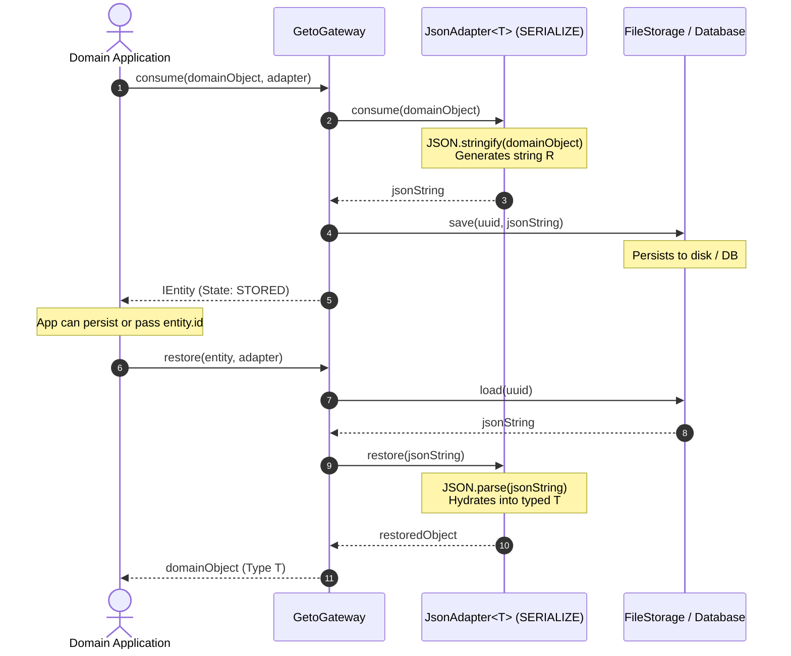

# `SERIALIZE` Semantic Specification

| Property | Details |
|---|---|
| **Semantic Identifier** | `EConsumptionSemantic.SERIALIZE` (`'serialize'`) |
| **Built-in Implementation** | `JsonAdapter<T>` |
| **Source Type ($T$)** | Structured Object / Record / Primitive `T` |
| **Representation Type ($R$)** | Formatted Data String (`string`) or Binary Buffer (`Buffer`) |
| **Ownership Model** | Transformation & Encapsulation ($T \neq R$) |
| **Release Hook** | None required (Inert static data) |

---

## 1. Mental Model & Problem Statement

In application development, rich runtime state (objects, class instances, nested configuration trees, user sessions) lives in volatile memory. However, storage media (disk, databases, remote caches) deal exclusively in strings or byte sequences.

The **`SERIALIZE`** semantic formalizes the transformation between rich in-memory domain models ($T$) and flat, persistable representations ($R$):
1. **Transformation:** The adapter converts runtime structures into persistent formats (JSON, YAML, Protocol Buffers, MessagePack).
2. **Persistence:** The gateway stores the serialized string or byte buffer without understanding its inner schema.
3. **Rehydration:** On `restore()`, the adapter parses and validates the representation, returning a fully typed domain object.
4. **Circularity & Safety:** Serializers must guard against circular references, serialization exceptions, and prototype pollution.

---

## 2. Sequence Diagram



---

## 3. Lifecycle Behaviors

| Operation | Action Taken | Entity State Transition | Error Conditions |
|---|---|---|---|
| `consume(object, adapter)` | Serializes object using `JSON.stringify()`, persists serialized text to storage. | `[Initial]` &rarr; `STORED` | Throws `AdapterError` if object has circular references or contains unstringifiable BigInts. Throws `StorageError` on disk write failure. |
| `restore(entity, adapter)` | Loads text from storage, parses via `JSON.parse()`, rehydrates typed object. | Unchanged (`STORED` or `RELEASED`) | Throws `AdapterError` if stored text is corrupted or invalid JSON. Throws `EntityStateError` if `DELETED`. |
| `release(entity, adapter)` | No-op (serialized data is inert). Marks state as `RELEASED`. | `STORED` &rarr; `RELEASED` | Throws `EntityStateError` if already `DELETED`. |
| `delete(id)` | Purges the file / record from the underlying storage. | `*` &rarr; `DELETED` | Throws `EntityNotFoundError` if not found. Throws `EntityStateError` if already `DELETED`. |

---

## 4. Production TypeScript Example

```typescript
import { GetoGateway, FileStorage, JsonAdapter, IEntity } from '@mrjacket/geto';
import * as path from 'node:path';

interface IOrganizationConfig {
  orgId: string;
  plan: 'enterprise' | 'growth' | 'free';
  limits: {
    maxUsers: number;
    rateLimitPerMinute: number;
  };
  features: string[];
}

async function run() {
  const storage = new FileStorage(path.resolve(process.cwd(), '.runtime-cache'));
  const gateway = new GetoGateway({ storage });
  const adapter = new JsonAdapter<IOrganizationConfig>();

  const config: IOrganizationConfig = {
    orgId: 'org_enterprise_99',
    plan: 'enterprise',
    limits: {
      maxUsers: 500,
      rateLimitPerMinute: 60000
    },
    features: ['sso', 'audit-logs', 'custom-domains']
  };

  // 1. Consume and persist domain state to disk
  const entity: IEntity = await gateway.consume(config, adapter, {
    metadata: { orgId: config.orgId, environment: 'production' }
  });

  console.log(`Config persisted under entity ID: ${entity.id}`);

  // 2. Rehydrate config on demand
  const rehydrated = await gateway.restore(entity, adapter);
  console.log(`Rehydrated plan: ${rehydrated.plan}`);
  console.log(`Max rate limit: ${rehydrated.limits.rateLimitPerMinute}`);

  // 3. Clean up
  await gateway.delete(entity.id);
}

run().catch(console.error);
```

---

## 5. Security & Architectural Guidelines

1. **Circular References:** Native `JSON.stringify()` throws a `TypeError` if an object contains circular references. `JsonAdapter` catches this and wraps it into a clean `AdapterError`. If circular structures must be stored, use a custom adapter leveraging `flatted` or dedicated serializers.
2. **Type Reconstitution:** `JsonAdapter` restores standard plain JavaScript objects (`POJO`). It does not automatically rebind prototype methods of ES6 classes unless a custom adapter defines explicit instantiation logic (e.g. `new User(parsed)`).
3. **Storage Independence:** Serialized strings can be saved to `MemoryStorage`, `FileStorage`, Redis, or SQL/NoSQL databases without adapting the caller's code.
