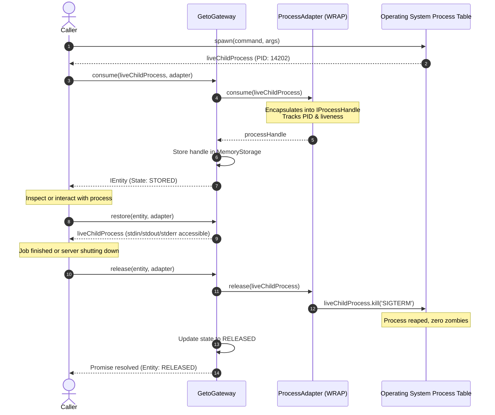

# `WRAP` Semantic Specification

| Property | Details |
|---|---|
| **Semantic Identifier** | `EConsumptionSemantic.WRAP` (`'wrap'`) |
| **Built-in Implementation** | `ProcessAdapter` |
| **Source Type ($T$)** | Node.js `ChildProcess` |
| **Representation Type ($R$)** | Managed Controller `IProcessHandle` |
| **Ownership Model** | Supervised Live Reference |
| **Release Hook** | Guaranteed Operating System Termination (`SIGTERM`) |

---

## 1. Mental Model & Problem Statement

Not all application resources can (or should) be serialized into strings or byte buffers. Active network sockets, database transaction handles, worker threads, and **operating system child processes** are stateful, executing entities.

Attempting to serialize a child process makes no sense. However, these resources urgently need **lifecycle supervision**:
- If an uncaught exception occurs or the main Node.js process receives `SIGINT`, child processes often become **zombies** or orphaned daemons consuming 100% CPU.
- Developers lack a unified mechanism to track which processes are running, what metadata describes their job, and how to safely terminate them when done.

The **`WRAP`** semantic manages live, running resources:
1. It does not freeze or serialize the resource into static data.
2. It encapsulates the live process inside a managed `IProcessHandle` controller interface.
3. It exposes real-time state inspection (`isAlive()`, `pid`, `process`).
4. It registers a strict **`release()` contract** that guarantees clean termination (`SIGTERM`) when the entity's active lifecycle concludes.

---

## 2. Sequence Diagram



---

## 3. Deep Dive: `release()` vs `delete()`

The `WRAP` semantic perfectly demonstrates why `release()` and `delete()` are separated in `geto`:

- **`gateway.release(entity, adapter)` (Resource Cleanup):**
  - Sends `SIGTERM` to the live child process.
  - The process terminates safely in the operating system.
  - The entity descriptor **remains accessible** in the gateway with state `RELEASED`. You can still query its metadata, timestamps, and inspect its execution history.
- **`gateway.delete(entity.id)` (Storage Cleanup):**
  - Removes the entity from storage completely.
  - Transitions the entity to the terminal state `DELETED`.
  - Any further attempts to read or manipulate the entity throw `EntityStateError`.

---

## 4. The `IProcessHandle` Interface

When stored or inspected, the representation implements `IProcessHandle`:

```typescript
export interface IProcessHandle {
  /** The underlying Node.js ChildProcess instance. */
  readonly process: ChildProcess;

  /** Process identifier assigned by the operating system, if available. */
  readonly pid?: number;

  /** Checks whether the underlying process is currently running. */
  isAlive(): boolean;

  /** Sends a termination signal to the wrapped child process (defaults to 'SIGTERM'). */
  kill(signal?: NodeJS.Signals | number): boolean;
}
```

---

## 5. Production TypeScript Example

```typescript
import { spawn } from 'node:child_process';
import { GetoGateway, MemoryStorage, ProcessAdapter, IProcessHandle } from '@mrjacket/geto';

async function run() {
  // Use MemoryStorage for live handles (process handles cannot be written to disk)
  const gateway = new GetoGateway({ storage: new MemoryStorage() });
  const adapter = new ProcessAdapter();

  // 1. Spawn a background transcoding worker
  const child = spawn(process.execPath, ['-e', 'setInterval(() => {}, 1000)'], {
    stdio: 'ignore'
  });

  // 2. Consume into gateway
  const entity = await gateway.consume(child, adapter, {
    metadata: { job: 'video-transcode-4k', targetFile: 'movie.mp4' }
  });

  console.log(`Process registered under entity: ${entity.id}`);

  // 3. Inspect live process handle
  const handle = (await gateway.storage.load(entity.id)) as IProcessHandle;
  console.log(`Worker PID: ${handle.pid}, isAlive: ${handle.isAlive()}`);

  // 4. Clean shutdown
  console.log('Terminating worker via gateway.release()...');
  await gateway.release(entity, adapter);

  console.log(`Post-release isAlive: ${handle.isAlive()}`);
  console.log(`Entity state: ${(await gateway.get(entity.id)).state}`); // 'released'

  // 5. Delete descriptor from gateway
  await gateway.delete(entity.id);
}

run().catch(console.error);
```

---

## 6. Important Operational Notes

1. **Storage Compatibility:** Because active processes depend on operating system PIDs and file descriptors, adapters with the `WRAP` semantic **must be paired with `MemoryStorage`**. Attempting to write an active `ChildProcess` to `FileStorage` will fail or lose runtime functionality upon restart.
2. **Signal Handling:** On Windows systems, POSIX signals like `SIGTERM` and `SIGINT` are translated by the Node.js runtime into process termination. `ProcessAdapter` checks whether the process has already exited (`process.exitCode !== null || process.killed`) before attempting to send signals, preventing superfluous signal exceptions.
